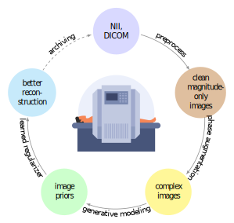

## Generative Image Priors for MRI Reconstruction Trained from Magnitude-Only Images

This folder includes the scripts that implement the workflow proposed in our paper. This project has a certain capacity to handle a large dataset (~100k images) on a Linux-based platform. It provides functionalities for preprocessing the data and training generative models using the dataset, and it was tested on a local GPUs workstation and HPC cluster. With this project, users can efficiently to extract prior information from large datasets for MRI reconstruction.

1. [Preprocess dataset](./scripts/augmentation)
2. [Phase augmentation](./scripts/augmentation)
3. [Train generative priors](./scripts/train)
4. [Image reconstruction with priors](./scripts/recon)

 
# Related repositories
1. [bart](https://github.com/mrirecon/bart)
2. [spreco](https://github.com/mrirecon/spreco)
3. [bart tutorials](https://github.com/mrirecon/bart-workshop)

## Citation
1. Luo, G, Blumenthal, M, Heide, M, Uecker, M. Bayesian MRI reconstruction with joint uncertainty estimation using diffusion models. Magn Reson Med. 2023; 1-17
2. Blumenthal, M, Luo, G, Schilling, M, Holme, HCM, Uecker, M. Deep, deep learning with BART. Magn Reson Med. 2023; 89: 678- 693.
3. Luo, G, Zhao, N, Jiang, W, Hui, ES, Cao, P. MRI reconstruction using deep Bayesian estimation. Magn Reson Med. 2020; 84: 2246-2261.
